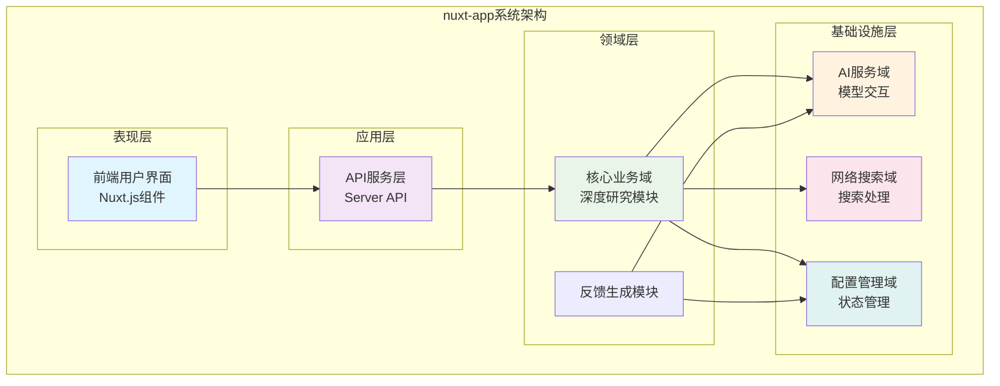
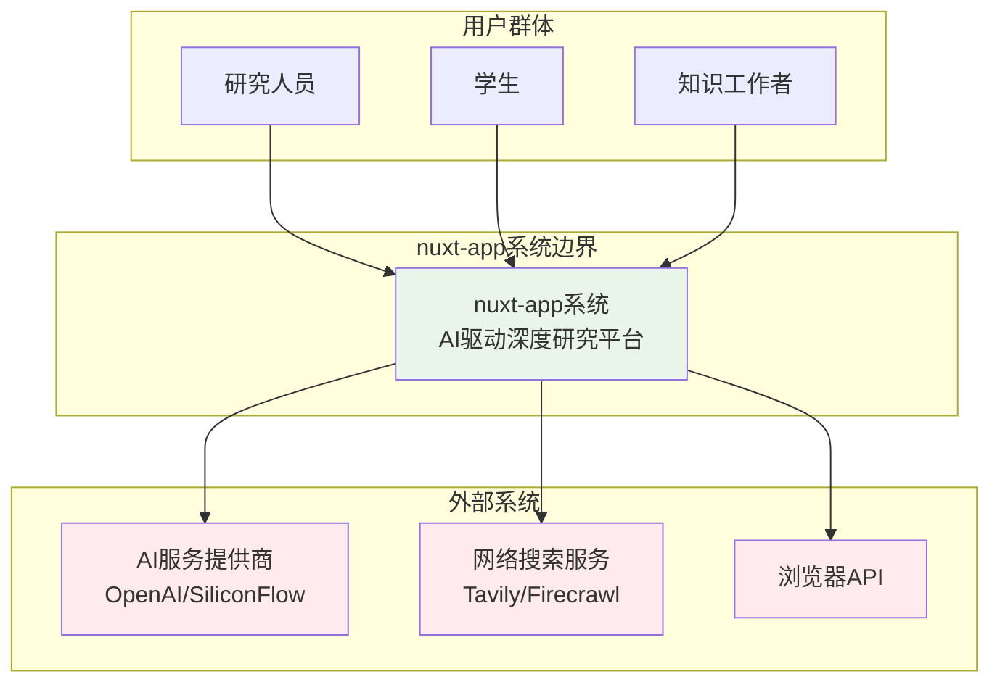
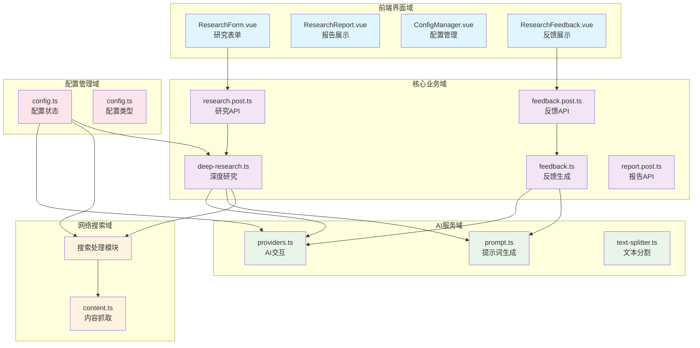
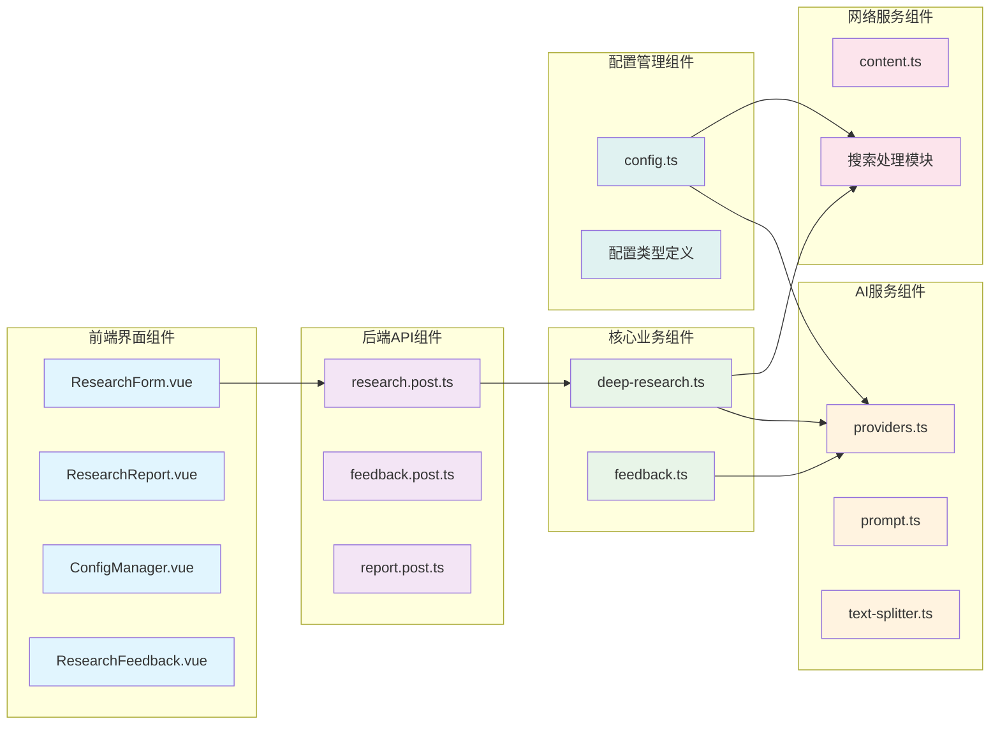
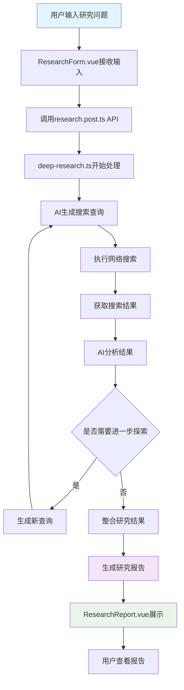
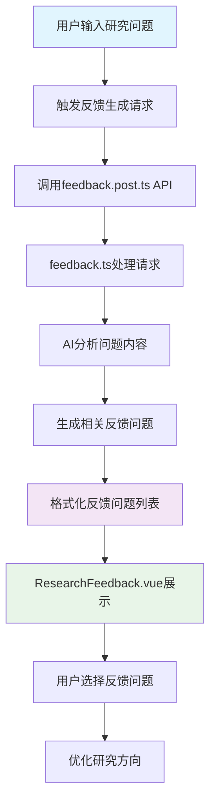
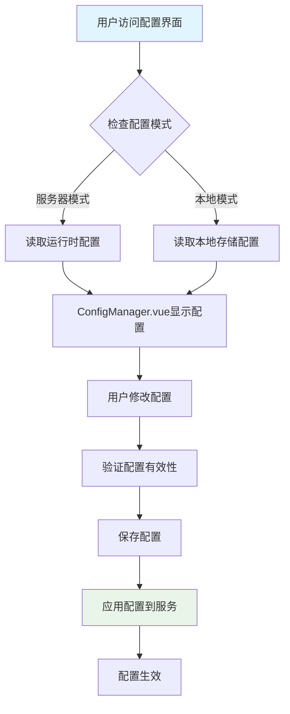
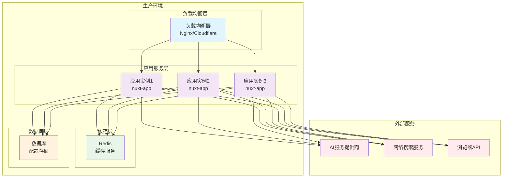

# 系统架构文档

## 1. 架构概览 (Architecture Overview)

### 1.1 架构设计理念

本系统采用**领域驱动设计（DDD）**和**前后端分离**的架构理念，构建了一个AI驱动的深度研究和分析系统。架构设计遵循以下核心原则：

- **单一职责原则**：每个模块专注于特定的业务领域，确保职责清晰
- **高内聚低耦合**：领域模块内部高度内聚，模块间通过明确定义的接口协作
- **可扩展性**：模块化设计支持新AI服务提供商和搜索服务的快速集成
- **可维护性**：清晰的架构分层和模块划分，便于系统维护和升级

### 1.2 核心架构模式

系统采用**分层架构**结合**领域驱动设计**的混合架构模式：

- **表现层**：基于Nuxt.js的前端界面，提供用户交互体验
- **应用层**：API服务层，处理业务逻辑和流程协调
- **领域层**：核心业务逻辑，包括深度研究、反馈生成等
- **基础设施层**：AI服务、网络搜索、配置管理等支撑服务

### 1.3 技术栈概述

- **前端框架**：Nuxt.js 3.x（Vue 3 + TypeScript）
- **状态管理**：Pinia
- **国际化**：Vue I18n
- **后端服务**：Nuxt.js Server API
- **AI集成**：OpenAI、SiliconFlow等AI服务提供商
- **搜索服务**：Tavily、Firecrawl等网络搜索API
- **构建工具**：Vite、TypeScript



## 2. 系统上下文 (System Context)

### 2.1 系统定位与价值

本系统是一个AI驱动的深度研究和分析平台，旨在通过递归网络搜索和智能分析技术，帮助用户深入探索复杂问题。系统的核心价值体现在：

- **效率提升**：通过AI自动化处理，显著减少人工研究时间
- **质量保证**：多角度分析和递归探索，提高研究结果的深度和准确性
- **智能辅助**：AI生成的反馈问题帮助用户明确研究方向
- **知识整合**：将分散的网络信息整合为结构化的研究报告

### 2.2 用户角色与场景

系统服务于三类主要用户群体：

**研究人员**
- 需求：深度分析能力、多角度探索、高质量研究报告
- 使用场景：学术研究、市场分析、技术调研

**学生**
- 需求：快速获取信息、结构化研究流程、多语言支持
- 使用场景：论文写作、课程作业、学术探索

**知识工作者**
- 需求：高效研究工具、智能数据整理、可追溯的研究过程
- 使用场景：商业分析、政策研究、行业洞察

### 2.3 外部系统交互

系统与以下外部系统进行交互：

- **AI服务提供商**：OpenAI、SiliconFlow等，提供AI模型调用服务
- **网络搜索服务**：Tavily、Firecrawl等，提供网络搜索API
- **浏览器API**：用于网页内容抓取的第三方服务

### 2.4 系统边界定义

**包含组件：**
- 前端用户界面
- 后端API服务
- AI模型集成
- 网络搜索集成
- 配置管理系统
- 历史记录功能
- 多语言支持

**排除组件：**
- 外部AI服务
- 外部搜索服务
- 用户本地数据存储
- 第三方浏览器API



## 3. 容器视图 (Container View)

### 3.1 领域模块划分

系统按照业务功能划分为五个核心领域模块：

#### 3.1.1 前端界面域
- **职责**：用户交互界面展示和操作处理
- **组件**：ResearchForm.vue、ResearchReport.vue、ConfigManager.vue等
- **技术栈**：Vue 3、Nuxt.js、TypeScript

#### 3.1.2 核心业务域
- **职责**：深度研究算法、反馈生成、递归搜索等核心业务逻辑
- **组件**：deep-research.ts、feedback.ts、API服务
- **技术栈**：TypeScript、Node.js

#### 3.1.3 AI服务域
- **职责**：AI模型交互、提示词生成、文本处理
- **组件**：providers.ts、prompt.ts、text-splitter.ts
- **技术栈**：OpenAI API、AI模型集成

#### 3.1.4 网络搜索域
- **职责**：网络搜索执行、内容抓取、结果处理
- **组件**：content.ts、搜索处理模块
- **技术栈**：Tavily API、Firecrawl API

#### 3.1.5 配置管理域
- **职责**：全局配置管理、模式切换、状态管理
- **组件**：config.ts、配置类型定义
- **技术栈**：Pinia、TypeScript

### 3.2 领域模块架构



### 3.3 存储设计

系统采用分布式存储策略：

- **前端状态存储**：Pinia状态管理，存储用户配置和临时数据
- **本地配置存储**：浏览器localStorage，存储用户个性化配置
- **服务器配置存储**：运行时配置，支持服务器模式
- **历史记录存储**：研究结果的持久化存储

### 3.4 领域模块间通信

- **前端到后端**：HTTP API调用，RESTful接口设计
- **后端内部**：函数调用和依赖注入
- **配置同步**：Pinia状态管理实现配置的实时同步
- **事件驱动**：通过事件总线处理跨域通信

## 4. 组件视图 (Component View)

### 4.1 核心功能组件

#### 4.1.1 深度研究组件 (deep-research.ts)
- **职责**：实现AI驱动的递归网络搜索和分析系统
- **核心功能**：
  - 生成搜索查询
  - 执行递归搜索
  - 分析搜索结果
  - 生成研究报告
- **依赖组件**：AI服务域、网络搜索域

#### 4.1.2 反馈生成组件 (feedback.ts)
- **职责**：生成AI驱动的反馈问题帮助用户明确研究方向
- **核心功能**：
  - 生成反馈问题
  - 格式化AI响应
  - 优化研究方向
- **依赖组件**：AI服务域

#### 4.1.3 研究表单组件 (ResearchForm.vue)
- **职责**：处理用户输入研究问题的界面组件
- **核心功能**：
  - 接收用户输入
  - 提交研究任务
  - 配置管理
- **依赖组件**：配置管理域

### 4.2 技术支撑组件

#### 4.2.1 AI模型交互组件 (providers.ts)
- **职责**：处理AI模型调用和响应流处理
- **核心功能**：
  - 模型调用
  - 响应处理
  - 流式传输
- **技术特点**：支持多种AI服务提供商

#### 4.2.2 提示词生成组件 (prompt.ts)
- **职责**：生成AI助手的提示词模板
- **核心功能**：
  - 生成系统提示
  - 生成语言提示
  - 模板管理
- **技术特点**：可配置的提示词模板系统

#### 4.2.3 配置管理组件 (config.ts)
- **职责**：管理应用的配置状态
- **核心功能**：
  - 状态管理
  - 模式切换
  - 配置验证
- **技术特点**：支持服务器模式和本地模式

### 4.3 组件职责划分



### 4.4 组件交互关系

- **同步调用**：前端组件直接调用后端API
- **异步处理**：AI服务的流式响应处理
- **状态同步**：配置管理组件的状态同步机制
- **事件驱动**：组件间的事件通信

## 5. 关键流程 (Key Processes)

### 5.1 核心功能流程

#### 5.1.1 深度研究流程



**流程特点：**
- **递归搜索**：基于AI分析结果生成新的搜索查询
- **智能分析**：AI模型对搜索结果进行深度分析
- **结果整合**：将多轮搜索结果整合为完整报告

#### 5.1.2 AI反馈生成流程



**流程特点：**
- **智能推荐**：基于AI分析生成相关问题
- **用户导向**：帮助用户明确研究方向
- **交互优化**：提供选择机制优化研究流程

### 5.2 技术处理流程

#### 5.2.1 配置管理流程



**流程特点：**
- **双模式支持**：服务器模式和本地模式
- **实时生效**：配置修改后立即生效
- **验证机制**：确保配置的正确性

### 5.3 数据流转路径

- **输入路径**：用户界面 → API服务 → 业务逻辑 → AI服务
- **处理路径**：AI服务 → 网络搜索 → 结果分析 → 报告生成
- **输出路径**：报告生成 → 用户界面 → 结果展示
- **配置路径**：配置管理 → 服务组件 → 实时同步

### 5.4 异常处理机制

- **网络异常**：重试机制和降级策略
- **AI服务异常**：备用模型和错误恢复
- **配置异常**：默认配置和错误提示
- **用户输入异常**：输入验证和友好提示

## 6. 技术实现 (Technical Implementation)

### 6.1 核心模块实现

#### 6.1.1 深度研究模块实现

深度研究模块是系统的核心，实现了AI驱动的递归搜索算法：

```typescript
// 核心算法逻辑
async function deepResearch(query: string, depth: number = 3) {
  const results = [];
  
  // 递归搜索算法
  for (let i = 0; i < depth; i++) {
    const searchQuery = await generateSearchQuery(query, results);
    const searchResults = await performSearch(searchQuery);
    const analysis = await analyzeResults(searchResults);
    
    results.push({
      query: searchQuery,
      results: searchResults,
      analysis: analysis
    });
    
    // 检查是否需要继续深入
    if (!needsFurtherExploration(analysis)) {
      break;
    }
  }
  
  return generateFinalReport(results);
}
```

**技术特点：**
- **递归算法**：支持多轮深度搜索
- **智能分析**：AI驱动的结果分析
- **动态终止**：基于分析结果的智能终止机制

#### 6.1.2 AI服务集成实现

AI服务域实现了对多种AI服务提供商的统一抽象：

```typescript
// AI服务提供商抽象
interface AiProvider {
  callModel(prompt: string): Promise<string>;
  streamModel(prompt: string): AsyncIterable<string>;
}

// 具体实现
class OpenAiProvider implements AiProvider {
  async callModel(prompt: string): Promise<string> {
    // OpenAI API调用实现
  }
  
  async *streamModel(prompt: string): AsyncIterable<string> {
    // 流式响应实现
  }
}
```

**技术特点：**
- **统一接口**：抽象不同AI服务的差异
- **流式处理**：支持实时响应流处理
- **可扩展性**：易于集成新的AI服务

### 6.2 关键算法设计

#### 6.2.1 递归搜索算法

递归搜索算法是系统的核心算法，通过AI分析结果生成新的搜索查询：

```typescript
class RecursiveSearchAlgorithm {
  private maxDepth: number = 3;
  private minRelevance: number = 0.7;
  
  async execute(initialQuery: string): Promise<ResearchResult> {
    const context: SearchContext = {
      query: initialQuery,
      depth: 0,
      results: [],
      visitedUrls: new Set()
    };
    
    return await this.searchRecursively(context);
  }
  
  private async searchRecursively(context: SearchContext): Promise<ResearchResult> {
    if (context.depth >= this.maxDepth) {
      return this.generateReport(context);
    }
    
    const searchQuery = await this.generateSubQuery(context);
    const searchResults = await this.performSearch(searchQuery, context.visitedUrls);
    
    // 分析搜索结果的相关性
    const relevantResults = searchResults.filter(
      result => this.calculateRelevance(result, context.query) > this.minRelevance
    );
    
    if (relevantResults.length === 0) {
      return this.generateReport(context);
    }
    
    // 更新上下文
    context.results.push(...relevantResults);
    context.depth++;
    
    // 递归搜索
    return await this.searchRecursively(context);
  }
}
```

#### 6.2.2 文本分割算法

文本分割算法确保大块文本能够被AI模型有效处理：

```typescript
class TextSplitter {
  private maxChunkSize: number = 2000;
  private overlapSize: number = 200;
  
  split(text: string): string[] {
    const chunks: string[] = [];
    const sentences = this.splitIntoSentences(text);
    
    let currentChunk = '';
    
    for (const sentence of sentences) {
      if (currentChunk.length + sentence.length <= this.maxChunkSize) {
        currentChunk += sentence;
      } else {
        chunks.push(currentChunk);
        // 保留重叠部分
        currentChunk = this.getOverlap(currentChunk) + sentence;
      }
    }
    
    if (currentChunk) {
      chunks.push(currentChunk);
    }
    
    return chunks;
  }
  
  private getOverlap(chunk: string): string {
    const words = chunk.split(' ');
    const overlapWords = words.slice(-this.overlapSize);
    return overlapWords.join(' ');
  }
}
```

### 6.3 数据结构设计

#### 6.3.1 研究结果数据结构

```typescript
interface ResearchResult {
  id: string;
  query: string;
  timestamp: Date;
  depth: number;
  sources: SearchResult[];
  analysis: AnalysisResult[];
  report: string;
  feedbackQuestions: string[];
  metadata: {
    searchQueries: string[];
    processingTime: number;
    aiModel: string;
  };
}

interface SearchResult {
  url: string;
  title: string;
  content: string;
  relevance: number;
  source: string;
  timestamp: Date;
}

interface AnalysisResult {
  query: string;
  findings: string[];
  insights: string[];
  confidence: number;
  relatedQueries: string[];
}
```

#### 6.3.2 配置数据结构

```typescript
interface AppConfig {
  aiProvider: AiProviderConfig;
  searchProvider: SearchProviderConfig;
  uiSettings: UiSettings;
  advancedSettings: AdvancedSettings;
}

interface AiProviderConfig {
  provider: 'openai' | 'siliconflow' | 'custom';
  model: string;
  apiKey: string;
  temperature: number;
  maxTokens: number;
}

interface SearchProviderConfig {
  provider: 'tavily' | 'firecrawl' | 'custom';
  apiKey: string;
  maxResults: number;
  searchDepth: number;
}
```

### 6.4 性能优化策略

#### 6.4.1 缓存策略

- **结果缓存**：缓存相似查询的研究结果
- **AI响应缓存**：缓存AI模型的响应结果
- **搜索结果缓存**：缓存网络搜索结果

#### 6.4.2 并发处理

- **异步处理**：使用async/await处理异步操作
- **并行搜索**：支持多个搜索查询的并行执行
- **流式处理**：实时处理AI响应流

#### 6.4.3 资源管理

- **连接池**：管理API连接池
- **内存管理**：优化大文本处理的内存使用
- **垃圾回收**：及时清理临时数据

## 7. 部署架构 (Deployment Architecture)

### 7.1 运行环境要求

#### 7.1.1 硬件要求
- **CPU**：至少4核处理器
- **内存**：8GB RAM（推荐16GB）
- **存储**：50GB可用空间
- **网络**：稳定的互联网连接

#### 7.1.2 软件要求
- **Node.js**：18.x或更高版本
- **NPM/Yarn**：包管理工具
- **Docker**：容器化部署（可选）
- **Git**：版本控制

### 7.2 部署拓扑结构



### 7.3 扩展性设计

#### 7.3.1 水平扩展
- **应用实例**：支持多实例部署，通过负载均衡分发请求
- **缓存集群**：Redis集群支持缓存的水平扩展
- **数据库分片**：支持数据库分片以处理大量数据

#### 7.3.2 垂直扩展
- **资源配置**：支持动态调整实例的CPU和内存资源
- **AI服务**：支持更高性能的AI模型和更大的上下文窗口
- **搜索服务**：支持更高级的搜索API和更大的并发数

### 7.4 监控与运维

#### 7.4.1 监控指标
- **应用性能**：响应时间、吞吐量、错误率
- **资源使用**：CPU、内存、网络使用率
- **业务指标**：研究任务完成率、AI调用成功率
- **用户体验**：页面加载时间、用户满意度

#### 7.4.2 日志管理
- **应用日志**：记录应用运行状态和错误信息
- **访问日志**：记录用户请求和响应信息
- **AI调用日志**：记录AI服务调用详情
- **搜索日志**：记录网络搜索操作

#### 7.4.3 健康检查
- **应用健康**：检查应用实例的运行状态
- **服务依赖**：检查外部服务的可用性
- **资源健康**：监控系统资源使用情况
- **业务健康**：验证核心业务功能的可用性

### 7.5 安全设计

#### 7.5.1 数据安全
- **API密钥管理**：安全存储和管理外部服务API密钥
- **数据加密**：敏感数据的传输和存储加密
- **访问控制**：基于角色的访问控制机制

#### 7.5.2 网络安全
- **HTTPS**：强制使用HTTPS加密传输
- **CORS**：配置跨域资源共享策略
- **防火墙**：网络访问控制和防护

#### 7.5.3 服务安全
- **速率限制**：防止API滥用和DDoS攻击
- **输入验证**：严格的用户输入验证
- **错误处理**：安全的错误信息处理

### 7.6 部署策略

#### 7.6.1 蓝绿部署
- **零停机部署**：通过蓝绿部署实现无缝升级
- **快速回滚**：支持快速回滚到稳定版本
- **流量切换**：支持逐步切换用户流量

#### 7.6.2 滚动更新
- **渐进式更新**：逐步更新应用实例
- **健康检查**：更新过程中持续监控健康状态
- **版本管理**：支持多版本并存和切换

#### 7.6.3 自动化部署
- **CI/CD流水线**：自动化构建、测试、部署
- **配置管理**：自动化配置管理和同步
- **监控告警**：自动化监控和告警机制

---

**文档生成时间**：2025-11-25 09:31:38 (UTC)  
**架构文档版本**：1.0  
**适用系统**：nuxt-app AI驱动深度研究系统