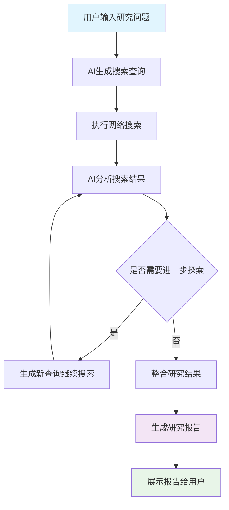
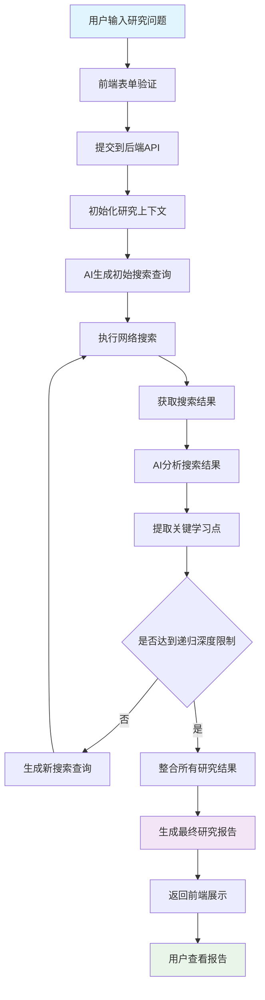
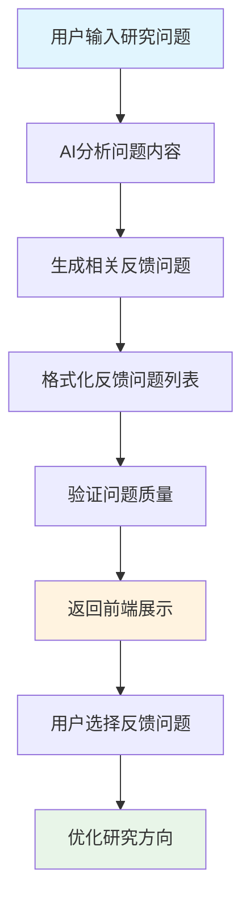
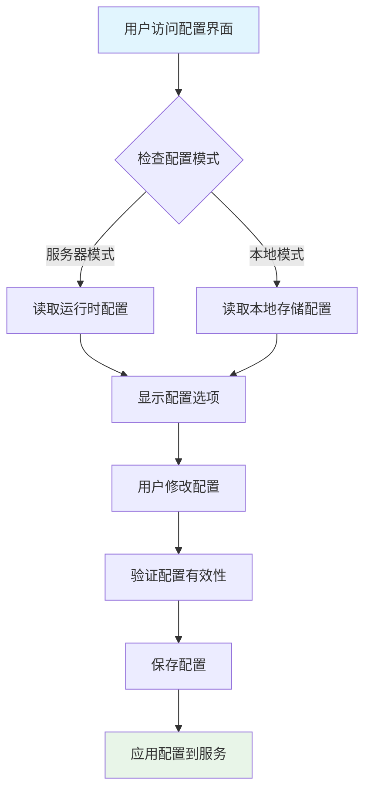
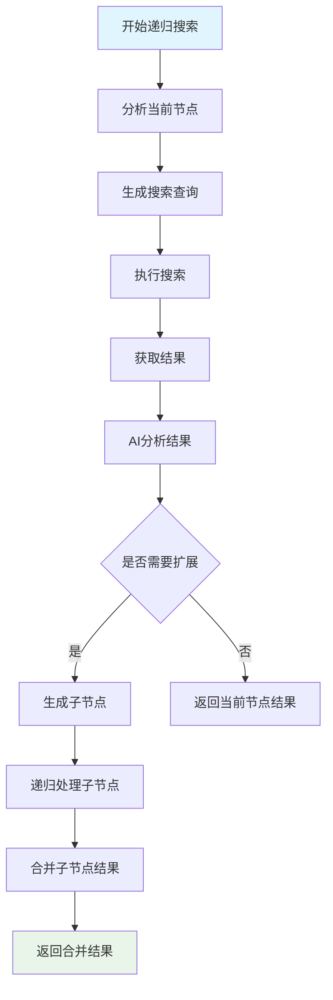

# 核心工作流程

## 1. 工作流程概览 (Workflow Overview)

### 1.1 系统主干工作流程

本系统是一个AI驱动的深度研究和分析系统，其核心工作流程围绕递归网络搜索和智能分析展开。系统通过用户输入的研究问题，利用AI模型生成搜索查询，执行网络搜索，分析结果并递归深入探索，最终生成详细的研究报告。

**主干流程图：**


### 1.2 核心执行路径

系统的核心执行路径包括：
- **输入处理路径**：从用户输入到AI模型处理的完整路径
- **搜索执行路径**：从查询生成到结果获取的搜索执行链路
- **分析处理路径**：从搜索结果到AI分析的智能处理流程
- **递归探索路径**：基于分析结果的递归搜索机制
- **报告生成路径**：从研究结果到最终报告的生成流程

### 1.3 关键流程节点

- **研究表单节点**：接收用户输入，触发研究流程
- **AI查询生成节点**：基于用户问题生成搜索查询
- **网络搜索节点**：执行搜索并获取结果
- **AI分析节点**：分析搜索结果并提取关键信息
- **递归决策节点**：判断是否需要进一步探索
- **报告生成节点**：整合结果并生成最终报告
- **结果展示节点**：向用户展示研究报告

### 1.4 流程协调机制

系统采用多层协调机制：
- **前端协调**：通过Nuxt.js的组合式API和状态管理协调UI组件
- **后端协调**：通过API路由协调核心业务逻辑
- **AI服务协调**：通过AI SDK协调模型调用和响应处理
- **配置协调**：通过Pinia状态管理协调全局配置

## 2. 主要工作流程 (Main Workflows)

### 2.1 深度研究流程

深度研究流程是系统的核心业务流程，实现了AI驱动的递归网络搜索和分析机制。

**详细流程图：**


**流程详解：**

1. **用户输入处理**：用户在前端界面输入研究问题，系统进行初步验证
2. **API请求处理**：前端通过POST请求将问题发送到后端API端点
3. **上下文初始化**：后端初始化研究上下文，包括配置信息、进度跟踪等
4. **初始查询生成**：AI模型基于用户问题生成初始搜索查询
5. **网络搜索执行**：使用配置的搜索服务提供商执行搜索
6. **结果分析处理**：AI模型分析搜索结果，提取关键信息和学习点
7. **递归决策**：根据配置的递归深度和分析结果决定是否继续搜索
8. **结果整合**：将所有研究结果整合成结构化数据
9. **报告生成**：生成详细的研究报告
10. **结果返回**：将报告返回前端并展示给用户

### 2.2 AI反馈生成流程

AI反馈生成流程帮助用户明确研究方向，通过AI模型生成相关后续问题。

**流程图：**


**流程详解：**

1. **问题分析**：AI模型分析用户输入的问题内容和上下文
2. **反馈生成**：基于分析结果生成多个相关反馈问题
3. **格式化处理**：将AI生成的问题格式化为结构化列表
4. **质量验证**：使用Zod验证生成问题的格式和质量
5. **结果返回**：将格式化的反馈问题返回前端
6. **用户选择**：用户从反馈问题中选择感兴趣的方向
7. **方向优化**：基于用户选择优化研究方向和范围

### 2.3 配置管理流程

配置管理流程管理AI提供商、模型选择、搜索服务等配置信息。

**流程图：**


**流程详解：**

1. **模式检测**：系统检测当前是服务器模式还是本地模式
2. **配置读取**：根据模式读取相应的配置信息
3. **界面展示**：在前端界面展示当前配置选项
4. **用户修改**：用户修改AI提供商、模型、搜索服务等配置
5. **配置验证**：验证配置的有效性和兼容性
6. **配置保存**：将配置保存到相应存储位置
7. **服务应用**：将新配置应用到AI服务和网络搜索服务

### 2.4 输入输出数据流转

**深度研究流程数据流转：**

```
输入: {query: string, config: Config, options: ResearchOptions}
├── AI查询生成: {queries: string[]}
├── 网络搜索: {searchResults: SearchResult[]}
├── 结果分析: {analysis: AnalysisResult[]}
├── 递归处理: {researchTree: ResearchNode[]}
└── 报告生成: {report: ResearchReport}
```

**AI反馈生成流程数据流转：**

```
输入: {query: string, language: string}
├── 问题分析: {queryAnalysis: QueryAnalysis}
├── 反馈生成: {rawFeedback: string}
├── 格式化处理: {structuredFeedback: FeedbackQuestion[]}
└── 验证返回: {validatedFeedback: FeedbackQuestion[]}
```

## 3. 流程协调与控制 (Flow Coordination)

### 3.1 多模块协调机制

系统采用分层协调机制，确保各模块间的有效协作：

**前端协调层：**
- 使用Nuxt.js的组合式API进行组件间数据传递
- 通过Provide/Inject模式在组件间共享表单数据、反馈数据和研究结果数据
- 利用Pinia状态管理统一管理应用状态

**后端协调层：**
- 通过API路由协调核心业务逻辑
- 使用服务层模式分离业务逻辑和数据访问
- 实现统一的错误处理和日志记录机制

**AI服务协调层：**
- 通过AI SDK协调模型调用和响应处理
- 实现流式处理机制处理AI模型响应
- 提供统一的AI服务接口抽象

### 3.2 状态管理和同步

**前端状态管理：**
- 使用Pinia创建全局配置状态管理store
- 实现服务器模式和本地模式的配置状态管理
- 提供配置验证和错误处理机制

**后端状态管理：**
- 在API处理过程中维护研究进度状态
- 实现递归搜索的树状状态管理
- 提供进度跟踪和中断恢复机制

### 3.3 数据传递和共享

**组件间数据传递：**
- 使用Nuxt.js的Provide/Inject模式
- 通过事件总线处理组件间通信
- 实现响应式数据绑定机制

**服务间数据传递：**
- 使用Promise和async/await处理异步数据流
- 实现流式数据处理机制
- 提供数据缓存和复用机制

### 3.4 执行控制和调度

**并发控制：**
- 实现搜索请求的并发限制
- 使用信号量控制AI模型调用频率
- 提供任务队列管理机制

**进度控制：**
- 实现研究进度的实时跟踪
- 提供中断和恢复机制
- 支持长时间运行任务的状态管理

## 4. 异常处理与恢复 (Exception Handling)

### 4.1 错误检测和处理

**AI服务错误处理：**
- 网络连接超时错误
- API调用限制错误
- 模型响应格式错误
- token数量超出限制错误

**网络搜索错误处理：**
- 搜索API调用失败
- 搜索结果解析错误
- 网络连接异常
- 搜索服务提供商错误

**前端错误处理：**
- 用户输入验证错误
- 网络请求失败
- 组件渲染错误
- 状态管理错误

### 4.2 异常恢复机制

**自动重试机制：**
```typescript
// 伪代码示例
async function retryWithBackoff(operation, maxRetries = 3) {
  for (let i = 0; i < maxRetries; i++) {
    try {
      return await operation();
    } catch (error) {
      if (i === maxRetries - 1) throw error;
      await sleep(Math.pow(2, i) * 1000); // 指数退避
    }
  }
}
```

**降级策略：**
- 当主要AI提供商不可用时，切换到备用提供商
- 当网络搜索失败时，使用缓存结果或简化搜索
- 当递归深度过大时，提前终止并返回部分结果

### 4.3 容错策略设计

**服务容错：**
- 实现AI服务的健康检查机制
- 提供搜索服务的故障转移机制
- 实现配置的动态更新和热加载

**数据容错：**
- 对AI生成的内容进行格式验证
- 实现数据的完整性检查
- 提供数据恢复和备份机制

### 4.4 失败重试和降级

**重试策略：**
- 网络请求失败：指数退避重试
- AI模型调用失败：切换模型或提供商
- 搜索API调用失败：使用备用搜索服务

**降级策略：**
- 当AI分析失败时，返回原始搜索结果
- 当递归搜索失败时，返回当前层级结果
- 当报告生成失败时，返回结构化数据

## 5. 关键流程实现 (Key Process Implementation)

### 5.1 核心算法流程

**递归搜索算法：**


**算法实现要点：**
- 使用树状数据结构管理递归搜索过程
- 实现深度限制和时间限制机制
- 提供搜索结果的去重和质量评估
- 实现结果的层次化整合

### 5.2 数据处理管道

**搜索结果处理管道：**
```
原始搜索结果 → 内容提取 → 文本分割 → AI分析 → 结构化输出
```

**管道实现：**
- 内容提取：从搜索结果中提取网页内容
- 文本分割：使用递归字符分割器处理长文本
- AI分析：对分割后的文本块进行智能分析
- 结构化输出：将分析结果组织成结构化数据

### 5.3 业务规则执行

**研究深度控制：**
- 最大递归深度限制
- 搜索查询数量限制
- 总执行时间限制

**质量控制：**
- 搜索结果相关性评估
- AI分析结果质量验证
- 最终报告完整性检查

### 5.4 技术实现细节

**AI提示词管理：**
- 系统提示词：定义AI助手角色和行为准则
- 语言提示词：确保AI以特定语言回应
- 上下文管理：维护对话历史和研究上下文

**文本处理优化：**
- 使用js-tiktoken计算token数量
- 实现智能文本截断算法
- 保持文本语义完整性的分割策略

**并发控制实现：**
- 使用信号量控制并发请求数量
- 实现请求队列管理机制
- 提供并发性能监控和调优

**配置管理实现：**
- 服务器模式：使用运行时配置
- 本地模式：使用localStorage存储
- 配置验证：确保配置项的有效性
- 动态更新：支持配置的热更新

通过以上详细的工作流程分析，系统实现了AI驱动的深度研究功能，提供了完整的递归搜索和智能分析能力，同时保证了系统的稳定性、可扩展性和用户体验。