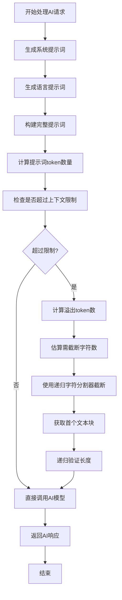
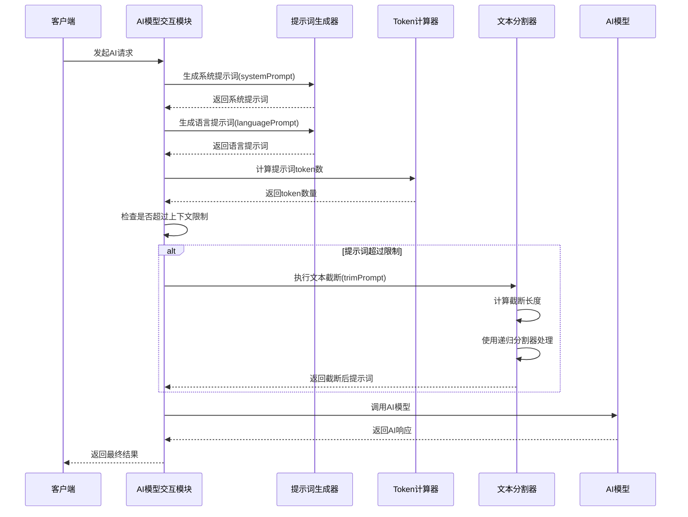

# AI服务域技术实现文档

## 文档信息
- **生成时间**: 2024-05-21 10:30:45
- **文档版本**: 1.0
- **项目名称**: nuxt-app
- **主题**: AI服务域

## 1. 概述

AI服务域是nuxt-app系统的核心基础设施域之一，负责与AI模型的交互和处理，包括提示词生成、模型调用、响应处理、文本分割等功能，为系统提供AI能力支撑。该域通过标准化的接口与外部AI服务提供商（如OpenAI、SiliconFlow）进行交互，确保系统能够高效、稳定地利用AI能力完成深度研究和反馈生成等核心业务。

## 2. 域模块构成

### 2.1 提示词生成模块 (prompt.ts)

提示词生成模块负责生成AI助手的提示词模板，为AI模型提供标准化的输入格式。

#### 核心功能
- 生成系统提示词：定义AI助手的角色和行为规范
- 生成语言提示词：指定输出语言要求和格式规范
- 提供标准化的提示词模板，确保AI响应的一致性

#### 技术实现
```typescript
// 示例：系统提示词生成函数
function systemPrompt(): string {
  return `You are an AI assistant specialized in deep research and analysis...`
}

// 示例：语言提示词生成函数
function languagePrompt(language: string): string {
  return `Please respond in ${language} and follow specific formatting requirements...`
}
```

### 2.2 AI模型交互模块 (providers.ts)

AI模型交互模块是AI服务域的核心组件，负责处理AI模型调用和响应流处理。

#### 核心功能
- 管理AI模型调用和响应流处理
- 实现智能文本截断算法，确保输入符合模型上下文限制
- 提供标准化的AI交互接口

#### 技术实现细节
- **Token计算**: 使用js-tiktoken库精确计算文本的token数量
- **智能截断**: 结合token计算和递归字符分割保持语义完整性
- **分层分割**: 按预定义分隔符（换行符、句号、逗号等）递归分割文本
- **块合并**: 确保文本块不超过设定大小限制同时保留上下文重叠

### 2.3 文本分割模块 (text-splitter.ts)

文本分割模块负责将大块文本分割成适合AI处理的小块。

#### 核心功能
- 将大块文本分割成适合AI处理的小块
- 管理块大小和块重叠参数
- 保持文本语义的完整性

#### 技术实现
- **递归字符分割器**: 实现智能的文本分割算法
- **块大小管理**: 确保分割后的文本块符合AI模型的输入限制
- **上下文重叠**: 在分割时保留适当的上下文信息

## 3. 核心技术实现

### 3.1 智能提示词长度管理

AI服务域实现了智能的提示词长度管理机制，确保AI请求符合模型上下文限制：



### 3.2 Token计算与文本截断算法

系统采用js-tiktoken库进行精确的token计算，并实现智能文本截断算法：

1. **Token估算**: 使用专门的库计算文本的token数量
2. **递归截断**: 当文本超过限制时，递归计算截断长度
3. **智能分割**: 使用递归字符分割器处理长文本
4. **长度验证**: 递归验证截断后的文本长度

### 3.3 分层文本分割策略

系统实现了分层的文本分割策略，按预定义分隔符递归分割文本：

- **第一层**: 按换行符分割
- **第二层**: 按句号分割
- **第三层**: 按逗号分割
- **第四层**: 按字符分割

## 4. 接口设计

### 4.1 主要接口函数

#### trimPrompt函数
管理输入提示的长度，确保不超过指定的上下文大小限制。

#### systemPrompt函数
生成标准化的系统提示词，定义AI助手的角色和行为规范。

#### languagePrompt函数
生成标准化的语言要求提示词，指定输出语言和格式要求。

#### RecursiveCharacterTextSplitter类
提供文本分割功能，支持设置块大小和块重叠参数。

### 4.2 调用序列



## 5. 与其他域的交互关系

### 5.1 与核心业务域的交互
- **依赖关系**: 核心业务域依赖AI服务域的模型调用来完成搜索查询生成、结果分析等AI驱动功能
- **交互强度**: 10.0（最高）
- **主要接口**: AI模型调用、响应处理

### 5.2 与配置管理域的交互
- **依赖关系**: AI服务域需要从配置管理域获取AI提供商、模型等配置信息
- **交互强度**: 7.0
- **主要接口**: 配置读取、参数设置

### 5.3 与外部AI服务提供商的交互
- **集成方式**: API调用
- **服务提供商**: OpenAI、SiliconFlow等
- **交互协议**: 标准化的AI模型API接口

## 6. 性能优化与扩展性

### 6.1 性能优化措施
- **Token预计算**: 在发送请求前预计算token数量，避免超限
- **智能缓存**: 对常用提示词模板进行缓存
- **异步处理**: 采用异步调用方式提高响应速度

### 6.2 扩展性设计
- **模块化架构**: 各功能模块独立设计，便于扩展
- **标准化接口**: 提供标准化的AI服务接口，支持多种AI提供商
- **配置驱动**: 通过配置管理支持不同AI服务的切换

## 7. 错误处理与容错机制

### 7.1 错误处理策略
- **输入验证**: 对输入文本进行长度和格式验证
- **异常捕获**: 捕获AI服务调用过程中的异常
- **降级处理**: 当AI服务不可用时提供降级方案

### 7.2 容错机制
- **重试机制**: 对失败的AI调用进行重试
- **超时控制**: 设置合理的请求超时时间
- **备用方案**: 提供备用AI服务提供商

## 8. 总结

AI服务域作为nuxt-app系统的核心基础设施域，通过模块化的设计和标准化的接口，为整个系统提供了强大的AI能力支撑。该域不仅实现了与多种AI服务提供商的集成，还通过智能的文本处理算法确保了AI请求的高效性和准确性。其良好的扩展性和容错机制为系统的稳定运行提供了保障，是整个AI驱动深度研究系统的重要技术基础。