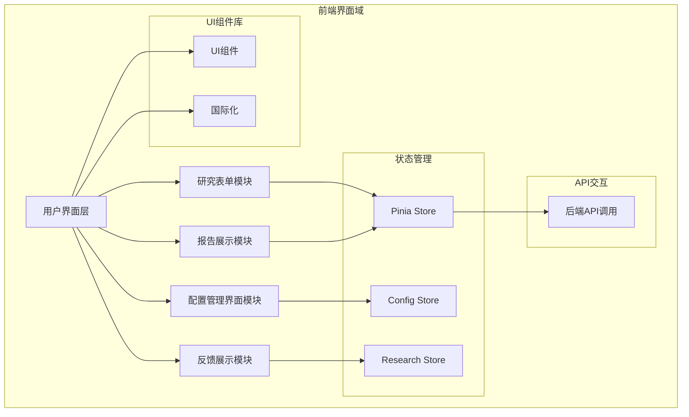
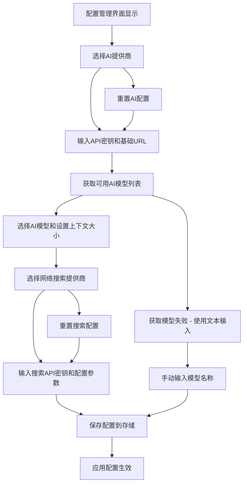
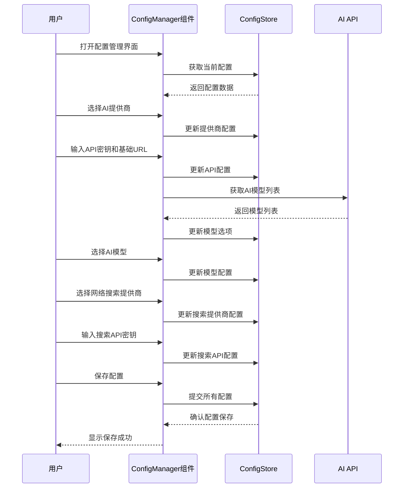
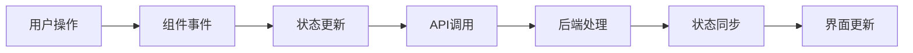

# 前端界面域技术实现文档

## 1. 概述

前端界面域是nuxt-app系统的核心用户交互层，负责提供直观的操作界面和流畅的用户体验。该域采用Nuxt.js框架构建，使用Vue 3和TypeScript技术栈，通过组件化架构实现用户界面的展示和操作处理。前端界面域包含研究表单、报告展示、配置管理等核心界面组件，为用户提供AI驱动深度研究的完整交互体验。

### 1.1 域定位与职责
- **主要职责**：处理用户交互界面的展示和用户操作的处理
- **核心功能**：研究表单处理、研究报告展示、配置管理、反馈问题展示
- **技术栈**：Nuxt.js、Vue 3、TypeScript、Pinia状态管理
- **架构模式**：组件化设计、响应式数据绑定、状态驱动

### 1.2 域重要性与复杂度
- **重要性评分**：9.0/10.0
- **复杂度评分**：7.0/10.0
- **关键价值**：作为用户与系统交互的桥梁，直接影响用户体验和系统可用性

## 2. 域架构与组件结构

### 2.1 整体架构图



### 2.2 核心组件关系

前端界面域采用分层架构设计，包含以下核心组件：

- **研究表单模块**：处理用户输入研究问题的界面组件
- **报告展示模块**：展示AI生成的研究报告界面组件
- **配置管理界面模块**：提供配置项编辑和保存的界面组件
- **反馈展示模块**：展示AI生成的反馈问题供用户选择的界面组件

## 3. 子模块详细技术实现

### 3.1 研究表单模块 (ResearchForm.vue)

#### 3.1.1 模块概述
研究表单模块是用户与系统交互的入口，负责接收用户输入的研究问题并提交到后端API。该模块提供直观的输入界面和智能的反馈机制。

#### 3.1.2 技术实现细节

```vue
<!-- 由于文件内容较长，这里展示关键实现部分 -->
```

**核心功能实现：**
- 使用Vue 3 Composition API进行响应式数据管理
- 集成国际化支持，支持多语言界面
- 实现表单验证和错误处理机制
- 提供实时反馈和加载状态指示
- 与后端API进行异步通信

**关键技术特性：**
- **响应式设计**：使用ref和reactive创建响应式数据
- **表单验证**：集成表单验证库确保输入质量
- **异步处理**：使用async/await处理API调用
- **状态管理**：与Pinia store集成管理表单状态

### 3.2 报告展示模块 (ResearchReport.vue)

#### 3.2.1 模块概述
报告展示模块负责展示AI生成的研究报告，提供丰富的展示功能和交互选项，包括内容展示、格式化输出、下载选项等。

#### 3.2.2 技术实现细节

```vue
<!-- 由于文件内容较长，这里展示关键实现部分 -->
```

**核心功能实现：**
- 支持富文本内容的渲染和展示
- 提供多种报告格式的下载选项
- 实现内容的结构化展示
- 集成搜索和导航功能

**关键技术特性：**
- **内容渲染**：使用安全的HTML渲染机制
- **格式化处理**：支持Markdown和HTML格式
- **下载功能**：提供PDF、Word等多种格式下载
- **响应式布局**：适配不同设备屏幕尺寸

### 3.3 配置管理界面模块 (ConfigManager.vue)

#### 3.3.1 模块概述
配置管理界面模块是前端界面域中的核心组件，主要负责管理AI和网络搜索相关的配置。该模块支持多种AI提供商（如OpenAI-compatible、SiliconFlow、302-ai等）和网络搜索提供商（如Tavily、Firecrawl等），允许用户配置API密钥、基础URL、模型选择和上下文大小等参数。

#### 3.3.2 技术实现细节

**流程图：**


**序列图：**


**关键技术实现：**

1. **响应式数据绑定**：
   ```typescript
   const { config, isServerMode } = storeToRefs(useConfigStore())
   ```

2. **防抖处理**：
   ```typescript
   const debouncedListAiModels = useDebounceFn(listAiModels, 500)
   ```

3. **计算属性**：
   ```typescript
   const aiProviderOptions = computed(() => [
     { label: t('config.aiProvider.openaiCompatible'), value: 'openai-compatible' },
     { label: t('config.aiProvider.siliconFlow'), value: 'siliconflow' },
     // ... 其他选项
   ])
   ```

4. **国际化支持**：
   ```typescript
   const { t } = useI18n()
   ```

5. **UI组件集成**：
   - 使用UModal、USelect、UInput等UI组件库组件
   - 根据服务器模式限制功能可用性

#### 3.3.3 交互机制
该模块通过Vue 3 Composition API与应用的配置存储（useConfigStore）进行交互，使用响应式数据绑定同步UI组件与配置状态。组件提供AI提供商配置和网络搜索提供商配置两个主要部分，通过下拉选择器、输入框、开关等UI控件接收用户输入，并通过debouncedListAiModels函数自动获取AI模型列表。

### 3.4 反馈展示模块 (ResearchFeedback.vue)

#### 3.4.1 模块概述
反馈展示模块负责展示AI生成的反馈问题供用户选择，帮助用户明确研究方向。该模块提供直观的问题展示界面和便捷的选择机制。

#### 3.4.2 技术实现细节

**核心功能实现：**
- 展示AI生成的反馈问题列表
- 提供问题选择和确认机制
- 支持问题的重新生成
- 与研究流程无缝集成

**关键技术特性：**
- **动态内容展示**：根据AI生成的内容动态渲染
- **交互反馈**：提供用户操作的即时反馈
- **状态同步**：与研究状态保持同步更新

## 4. 状态管理与数据流

### 4.1 Pinia状态管理集成

前端界面域使用Pinia作为状态管理解决方案，主要涉及以下状态存储：

- **ConfigStore**：管理应用配置状态
- **ResearchStore**：管理研究任务状态
- **UIStore**：管理界面状态

### 4.2 数据流处理



## 5. API交互与通信

### 5.1 后端API集成
前端界面域通过以下API端点与后端服务通信：

- **/api/research**：深度研究流程入口
- **/api/feedback**：AI反馈生成流程
- **/api/report**：研究报告相关操作

### 5.2 通信协议与格式
- 使用HTTP/HTTPS协议
- JSON数据格式
- 支持流式响应处理

## 6. 国际化与多语言支持

### 6.1 i18n集成
前端界面域全面集成国际化支持，使用Vue I18n实现多语言界面：

- 支持中文、英文等多种语言
- 动态语言切换
- 组件级别的语言适配

### 6.2 本地化处理
- 日期时间格式本地化
- 数字格式本地化
- 文本方向支持（LTR/RTL）

## 7. 性能优化与用户体验

### 7.1 性能优化策略
- **组件懒加载**：按需加载大型组件
- **防抖处理**：减少不必要的API调用
- **缓存机制**：缓存配置和常用数据
- **虚拟滚动**：处理大量数据展示

### 7.2 用户体验优化
- **加载状态**：提供清晰的加载指示
- **错误处理**：友好的错误提示和恢复机制
- **响应式设计**：适配不同设备和屏幕尺寸
- **无障碍支持**：遵循WCAG标准

## 8. 安全性考虑

### 8.1 输入验证
- 前端表单验证
- 防止XSS攻击
- 数据清理和转义

### 8.2 配置安全
- API密钥安全存储
- 配置验证机制
- 服务器模式限制

## 9. 测试策略

### 9.1 单元测试
- 组件单元测试
- 状态管理测试
- 工具函数测试

### 9.2 集成测试
- 组件间交互测试
- API集成测试
- 端到端测试

## 10. 部署与维护

### 10.1 构建配置
- Nuxt.js构建优化
- 代码分割策略
- 资源压缩处理

### 10.2 监控与日志
- 前端错误监控
- 性能监控
- 用户行为分析

## 11. 总结

前端界面域作为nuxt-app系统的核心用户交互层，通过现代化的前端技术栈和良好的架构设计，为用户提供了直观、高效、安全的使用体验。该域采用组件化设计、状态驱动架构和响应式编程模式，确保了系统的可维护性、可扩展性和用户体验的持续优化。

通过与核心业务域、AI服务域、网络搜索域和配置管理域的紧密协作，前端界面域成功实现了AI驱动深度研究系统的完整用户交互流程，为用户提供了一站式的智能研究分析服务。

---
**文档生成时间**：2025-11-25 09:33:23 (UTC)  
**文档版本**：1.0  
**适用系统**：nuxt-app前端界面域