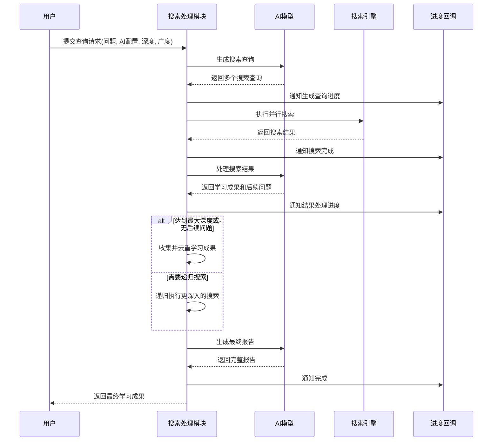

# 网络搜索域技术实现文档

## 文档信息
- **生成时间**: 2024-05-21 10:30:45
- **文档版本**: 1.0
- **主题**: 网络搜索域技术实现

## 1. 概述

网络搜索域是AI驱动深度研究系统的核心数据源模块，负责网络搜索功能的实现，包括搜索查询执行、结果获取、内容抓取等。该域为深度研究提供数据源，是系统实现AI驱动递归网络搜索和智能分析的基础支撑。

### 1.1 域定位
- **域类型**: 基础设施域
- **重要性**: 8.0/10.0
- **复杂度**: 7.0/10.0
- **主要职责**: 提供网络搜索和内容抓取功能

### 1.2 域内模块构成
网络搜索域包含两个核心子模块：
- **搜索处理模块**: 执行网络搜索并获取搜索结果
- **内容抓取模块**: 从搜索结果中抓取具体内容

## 2. 搜索处理模块技术实现

### 2.1 模块概述
搜索处理模块是一个深度研究功能模块，实现了AI驱动的递归网络搜索和分析系统。该模块通过AI模型生成搜索查询，执行网络搜索，分析结果并递归深入探索，最终生成详细研究报告。

### 2.2 核心功能实现

#### 2.2.1 搜索查询生成
模块使用AI模型根据用户输入的问题生成多个相关的搜索查询。通过`streamText`函数实现流式响应，支持生成多样化的搜索查询。

```typescript
// 核心实现位于 lib/core/deep-research.ts
// 使用Zod模式验证确保数据结构的准确性
```

#### 2.2.2 并行搜索执行
采用`pLimit`库实现并发控制，限制同时执行的搜索数量，避免对搜索服务造成过大压力。通过并行执行多个搜索查询提高搜索效率。

#### 2.2.3 递归搜索机制
模块采用树状结构进行递归搜索，通过`nodeId`追踪搜索节点。当AI分析搜索结果发现需要进一步探索时，会生成新的查询继续搜索，直到达到最大深度或无后续问题。

### 2.3 技术架构

#### 2.3.1 数据结构设计
使用Zod定义数据结构模式，包括：
- 搜索查询模式
- 搜索结果模式
- 研究步骤类型定义

#### 2.3.2 错误处理机制
通过`onError`回调和try-catch机制实现完善的错误处理，确保系统在搜索失败时能够优雅降级并提供进度报告。

#### 2.3.3 进度跟踪
通过`ResearchStep`类型定义不同的处理阶段，提供实时进度跟踪功能，让用户了解当前研究状态。

### 2.4 交互接口

#### 2.4.1 外部交互
- **Web搜索API**: 与外部搜索引擎进行交互
- **AI模型接口**: 使用流式文本生成接口与AI模型交互
- **进度回调接口**: 提供`progress`回调接口，用于实时通知研究进度

#### 2.4.2 配置参数
- 语言配置
- AI模型配置
- 搜索深度和广度参数
- 并发控制参数

## 3. 内容抓取模块技术实现

### 3.1 模块概述
内容抓取模块位于`server/utils/content.ts`，负责从搜索结果中抓取具体内容。该模块通过浏览器API实现网页内容的提取和处理。

### 3.2 核心功能
- **内容抓取**: 从搜索结果URL中提取网页内容
- **数据提取**: 从网页中提取关键信息和文本内容
- **格式处理**: 将抓取的内容转换为适合AI分析的格式

## 4. 模块间协作关系

### 4.1 与核心业务域的协作
搜索处理模块作为核心业务域的深度研究模块的重要组成部分，通过以下方式协作：
- 接收用户查询和AI配置参数
- 执行网络搜索并返回结果
- 支持递归搜索机制

### 4.2 与AI服务域的协作
- 调用AI模型生成搜索查询
- 使用AI分析搜索结果
- 生成后续问题和学习成果

### 4.3 与配置管理域的协作
- 从配置管理域获取搜索服务提供商配置
- 应用搜索参数配置

## 5. 工作流程

### 5.1 深度研究流程中的角色
在网络搜索域中，搜索处理模块在深度研究流程中承担以下角色：
1. **AI生成搜索查询**: 根据用户输入生成多个搜索查询
2. **执行网络搜索**: 并行执行搜索并获取结果
3. **AI分析搜索结果**: 分析结果并提取关键信息
4. **递归搜索**: 根据需要生成新查询继续搜索
5. **整合结果**: 收集并去重学习成果

### 5.2 时序图


## 6. 技术特点

### 6.1 并发控制
使用`pLimit`库实现搜索并发控制，确保系统性能和搜索服务的稳定性。

### 6.2 流式处理
采用流式文本生成接口，支持实时进度反馈和结果处理。

### 6.3 递归搜索
实现树状结构的递归搜索机制，支持深度探索复杂问题。

### 6.4 错误处理
完善的错误处理机制，包括重试逻辑和降级策略。

### 6.5 进度跟踪
实时进度跟踪功能，提供用户友好的研究过程反馈。

## 7. 配置与扩展

### 7.1 配置管理
网络搜索域从配置管理域获取以下配置：
- 搜索服务提供商（Tavily、Firecrawl等）
- 搜索参数配置
- 并发控制参数

### 7.2 扩展性
- 支持多种搜索服务提供商
- 可配置的搜索深度和广度
- 模块化设计便于功能扩展

## 8. 总结

网络搜索域作为AI驱动深度研究系统的重要组成部分，通过搜索处理模块和内容抓取模块的协作，为系统提供了强大的网络搜索和内容获取能力。该域采用现代化的技术架构，具备良好的并发控制、错误处理和进度跟踪功能，为深度研究提供了可靠的数据源支撑。模块化的设计使得系统具备良好的可扩展性和可维护性，能够适应不同场景下的搜索需求。